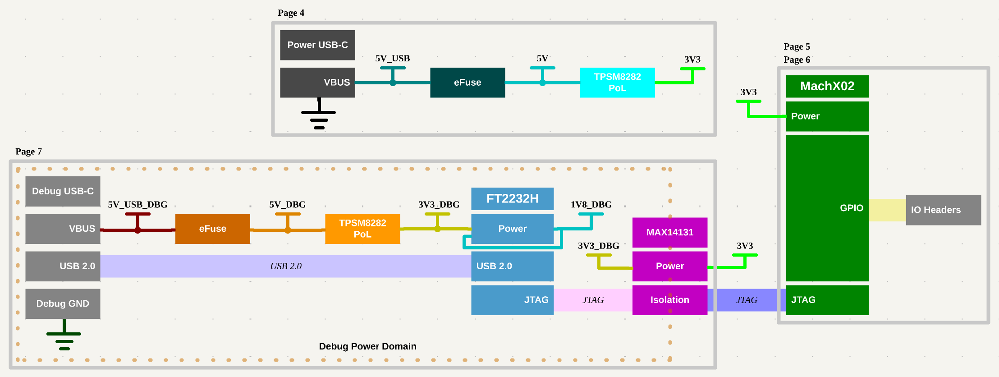

# MachX02 Design

## Objective
Design development/eval board for the Lattice MachX02 FPGA. Use TI TPS543320 and TI TPSM8282 DC-DC converters so there performance/behavior can be evaluated. Use good practices (eFuse, TVS diodes) for USB-C interfaces. Use FTDI2232H USB-JTAG bridge to enable programming the MachX02 over USB.
## Status
- KiCad project symbol and footprint libraries complete for anticipated parts. If other parts are required during design, symbols and footprints will be created and added to project libraries.
- KiCad preliminary schematic done. Need to create BOM and review before starting layout.
